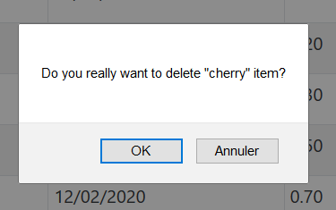

# ShoppingList
<h3>CRUD Maven project</h3>
 <h4>Tools</h4>

JSF - Bootstrap - Hibernate - JPA - MYSQL - Tomcat

 <h4>Purpose </h4>
 

 This project is a part of my online documentation to keep solutions hand on. Anyone who need it can use it as he wish.

<h4>Description</h4>

 It is about create a shopping list. Items belong to a category, fruit or vegtable. It is a many to one relation. You can add, delete or modify items on the list.

In this project you will find a items list using a CRUD in a MVC pattern. Since controller is handle by the framework, I only coded the view and the model.

 

 For data management I used annotations.

  
<h4>As  a picture is worth a thousand words.</h4>

<b>Select All</b> 

<b>Insert</b>  

<b>Update</b>  

<b>Delete confirmation</b>  

<b>Date fields</b>  

  

MYSQL QUERIES

CREATE SCHEMA `shopping_list` ;
  
CREATE USER 'test'@'localhost' IDENTIFIED BY 'pass'; 
GRANT ALL PRIVILEGES ON shopping_list.* TO 'test'@'localhost'; 
 
CREATE TABLE `shopping_list`.`category` ( 
  `id` INT NOT NULL AUTO_INCREMENT, 
  `name` VARCHAR(100) NULL, 
  PRIMARY KEY (`id`)); 
   
insert into category (name) values ("fruit"); 
insert into category (name) values ("vegtables"); 
 
CREATE TABLE `shopping_list`.`item` ( 
  `id` INT NOT NULL AUTO_INCREMENT, 
  `name` VARCHAR(100) NOT NULL, 
  `creation_date` TIMESTAMP NOT NULL DEFAULT CURRENT_TIMESTAMP, 
  `modification_date` TIMESTAMP NOT NULL ON UPDATE CURRENT_TIMESTAMP, 
  `price` DECIMAL(19,2) NULL, 
  `category_id` VARCHAR(45) NOT NULL, 
  PRIMARY KEY (`id`)); 
   
insert into item (name,modification_date,price,category_id) values ("apple",now(),0.5,1); 
insert into item (name,modification_date,price,category_id) values ("strawberry",now(),0.1,1); 
insert into item (name,modification_date,price,category_id) values ("cherry",now(),0.1,1); 
insert into item (name,modification_date,price,category_id) values ("grapefruit",now(),0.5,1); 
insert into item (name,modification_date,price,category_id) values ("lemon",now(),0.7,1); 
 
insert into item (name,modification_date,price,category_id) values ("carrot",now(),0.5,2); 
insert into item (name,modification_date,price,category_id) values ("onion",now(),0.3,2); 
insert into item (name,modification_date,price,category_id) values ("potato",now(),0.2,2); 
insert into item (name,modification_date,price,category_id) values ("green bean",now(),0.01,2); 
insert into item (name,modification_date,price,category_id) values ("corn",now(),0.6,2); 
   

> 
<b>Feel free to ask me questions, it will be a pleasure to answer you.</b>

